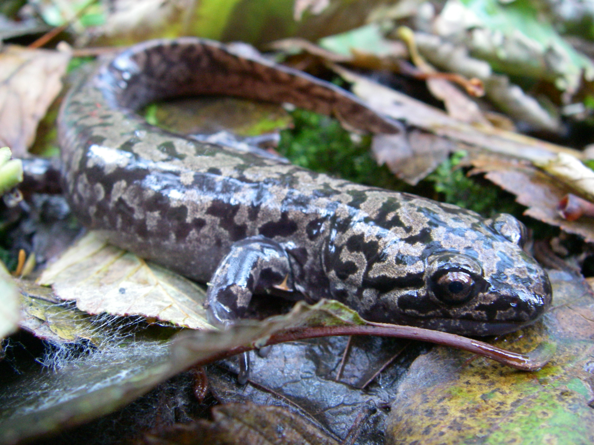
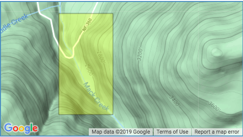

```{r setup, include=FALSE}
knitr::opts_chunk$set(warning = FALSE)
```


```{r,  echo = FALSE, include = FALSE, warning = FALSE}
library(tidyverse)
library(effsize)
library(janitor)
library(tidyr)
library(tidyr)
library(kableExtra)
library(car)
library(ggbeeswarm)
```

INTRODUCTION


Citation: Gregory S. V. 2016. Aquatic Vertebrate Population Study in Mack Creek, Andrews Experimental Forest, 1987 to present. Environmental Data Initiative. https://doi.org/10.6073/pasta/5de64af9c11579266ef20da2ff32f702. Dataset accessed 11/19/2019.



***Figure 1: Pacific Giant Salamander 'Dicamptodon tenebrosus'.*** *Pacific Giant Salamander chilling on a bed of leaves. (Credit: [Wikipedia](https://en.wikipedia.org/wiki/Pacific_giant_salamander))*


***Figure 2: Mack Creek, Andrews Experimental Forest.*** *Spacial Coverage of Study Site. (Credit: [LTER](https://portal.lternet.edu/nis/mapbrowse?scope=knb-lter-and&identifier=4027&revision=13))*


```{r}
mack_creek_vert <- readr::read_csv("mack_creek_vertebrates.csv") %>% 
  clean_names()
```

A. Visually compare annual salamander counts in old growth (OG) and clear cut (CC) sections of Mack Creek...

```{r}
mack_creek_dite <- mack_creek_vert %>% 
  filter(species %in% "DITE") %>% 
  count(year, section)

mack_creek_dite_table <- mack_creek_dite %>% 
  pivot_wider(names_from = section, values_from = n)
```

```{r}
ggplot(data = mack_creek_dite, aes(x = year, y = n, fill = section)) +
  geom_col(alpha = .8) +
  facet_wrap(~section) +
  scale_x_continuous(expand = c(0,0)) +
  scale_y_continuous(expand = c(0,0)) +
  theme_dark()
```

```{r}
ggplot(data = mack_creek_dite, aes(x = year, y = n)) +
  geom_line(color = "orange") +
  facet_wrap(~section) +
  scale_x_continuous(expand = c(0,0)) +
  theme_dark() +
  labs(y = "Total Counts",
       title = "Annual Salamander Counts in Old Growth (OG) & Clear Cut (CC)",
       caption = "1993 - 2017",
       x = NULL)
```

B. Table of 2017 salamander counts by channel classification (pool, cascades and side-channel) in old growth (OG) and clear cut (CC) sections of Mack Creek...

```{r}
#Get the counts....
mack_creek_counts <- mack_creek_vert %>% 
  filter(unittype %in% c("P", "C", "SC")) %>% 
  filter(species %in% "DITE") %>% 
  filter(year == "2017") %>% 
  filter(section %in% c("CC", "OG")) %>% 
  count(unittype, species, year, section) %>% 
  group_by(unittype, section) %>%
  group_by(section)

  
  

# wide formate
mack_creek_table <- mack_creek_counts %>% 
  select(-year, -species) %>% 
  pivot_wider(names_from = unittype, values_from = n)
```
 

Table of counts and proportions
```{r}
mack_creek_props <- mack_creek_table %>% 
  adorn_percentages(denominator = "row") %>% 
  adorn_pct_formatting(digits = 1) %>% 
  adorn_ns(position = "front")

mack_creek_props

kable(mack_creek_props) %>% 
  kable_styling(bootstrap_options = "striped", 
                full_width = F,
                position = "left") %>% 
  row_spec(c(1:2),
                   color = "purple")
```


C.  Is there a significant difference in where in the channel Pacific giant salamanders are located (pool, cascade or side channel) between the two sections (old growth and clear cut)? 

H0: Is there a significant difference in where pacific giant salamanders are located between the two sections? 

HA: There is no significant difference....


D. Compare weights of Pacific giant salamanders in clear cut and old growth forest sections of the creek in 2017

```{r}
mack_creek_weight <- mack_creek_vert %>% 
  select(year, species, section, weight) %>% 
  filter(year == "2017",
         species == "DITE",
         section %in% c("OG", "CC")) %>% 
  group_by(section) %>% 
  summarize(mean = mean(weight, na.rm = TRUE),
            sd = sd(weight, na.rm = TRUE),
            sample_size = n())
```

Is there a significant difference in mean weights for Pacific giant salamanders observed in the two forest sections (clear cut and old growth) in 2017? 
 


E. Compare weights of Pacific giant salamanders in pools, cascades and side-channels of Mack Creek in 2017...


